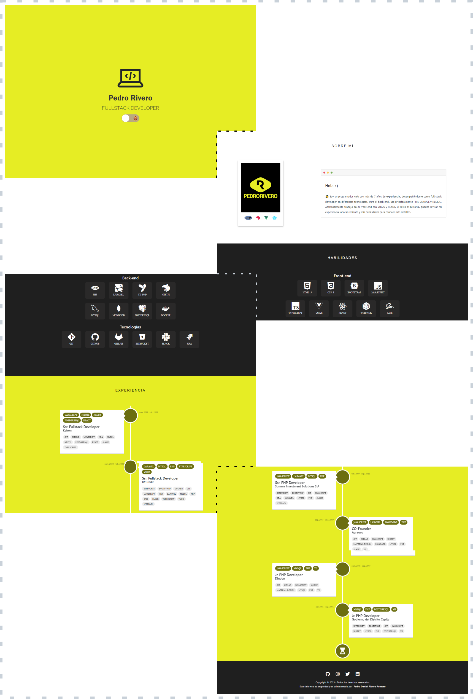

# React | Portfolio

## Used technology

- [React](https://reactjs.org/)
- [Sass](https://sass-lang.com/)
- [React Vertical](https://github.com/stephane-monnot/react-vertical-timeline)
- [React Awesome Slider](https://github.com/rcaferati/react-awesome-slider)
- [Iconify Design](https://iconify.design)

## Requirements

- [Node.js](https://nodejs.org/) v16 or newer, [NPM](https://www.npmjs.com/) package manager

## Getting Started

1. Clone repository
```
$ git clone https://github.com/pedroriverove/react-portfolio.git
```
4. Install project dependencies
```
$ npm install
```
5. Finally, launch the app
```
$ npm start
```

## Scripts

- `npm start` — Launches the app in development mode on [`http://localhost:3000`](http://localhost:3000/)
- `npm run build` — Compiles and bundles the app
- `npm run deploy` — Deployment

## Credits

- [Portfolio template](https://github.com/Dorota1997/react-frontend-dev-portfolio) — easy to adapt and deploy portfolio project covering most important sections(about, exp, skills, projects), inspired with solutions found at GitHub.

## Screenshot


